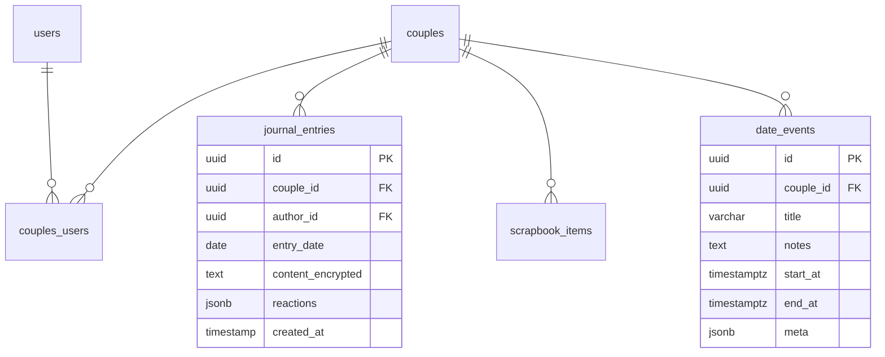

# Nestled – Shared Journal & Memory PWA  
**Product Requirements Document (PRD)**  
Version 0.1 — May 10 2025  

---

## 1 • Overview  
Nestled is a Progressive Web App (PWA) that gives couples a private, delightful space to **journal together, plan dates, and curate a shared scrapbook**.  
The product encourages quick, constructive daily check‑ins without the friction of long‑form prompts, and strengthens connection through playful features like random "Grok" questions and shared memories.

## 2 • Goals & Non‑Goals  
| Category | Goals | Non‑Goals |  
|---|---|---|  
|Product|• Foster daily communication • Make it effortless & fun (≤3 mins/day) • Feel *private & safe* by default|• Public social feed • Long‑form blogging platform|  
|Business|• Validate MVP with 100 pilot couples • Achieve ≥40 % D7 retention|• Monetization during MVP|

## 3 • Personas  
| Persona | Needs | Pain Points |  
|---|---|---|  
|"Busy Partners" 30‑40 yrs|Stay emotionally aligned despite packed schedules|Time/energy to craft thoughtful check‑ins|  
|"Newlyweds"|Create tradition & memory archive|Forgetting small moments|  
|"LDR Couples"|Low‑friction shared space across time zones|App fatigue & privacy concerns|

## 4 • UX Principles  
1. **One‑Hand, One‑Minute** – every core task can be done on a phone in ≤60 s.  
2. **Delightful Nudges** – gentle reminders, daily prompt at local 08:00 with optimistic micro‑copy.  
3. **Private First** – all content is end‑to‑end encrypted (client‑side AES) and never public‑by‑default.  
4. **Playful Warmth** – rounded corners, calm palette, subtle confetti animation on milestones.

## 5 • Core Features  

### 5.1 Daily Journal  
| Requirement | Details |  
|---|---|  
|Prompt of the Day|Pulled from Grok API; <120 chars; personal "shuffle" option|  
|Dual Entry|Each partner sees & answers separately; merged view after both submit|  
|Reactions|❤️ • 🤣 • 😮; no public metrics|  
|Streaks|Optional; local‑only to avoid pressure|  
|Privacy|Row‑level security + optional client AES|

### 5.2 Date Planner  
| Requirement | Details |  
|---|---|  
|Shared Calendar|List & month views; powered by FullCalendar ICS export & Google Calendar sync (OAuth)|  
|Idea Board|Pin/save ideas; auto‑suggest from journal "We should ..." mentions (NLP)|  
|Voting|Simple 👍/👎 to converge on plan|  
|Reminder|Push notification day before date|

### 5.3 Scrapbook  
| Requirement | Details |  
|---|---|  
|Media Upload|Photos, 30 s videos, voice notes (≤20 MB); stored in Supabase Storage|  
|Auto‑Layout|Masonry grid w/ lazy‑loading|  
|Caption & Tags|Free‑text + emojis; search by tag|  
|Memory Reel|Auto‑generate 30 s highlight video (future)|

## 6 • Non‑Functional Requirements  
* **PWA**: installable, offline read & write via Service Worker + local IndexedDB queue.  
* **Performance**: LCP < 1.5 s on 3G; TTI < 2 s.  
* **Accessibility**: WCAG AA.  
* **Security**: Supabase RLS; client‑side crypto; audit logging; Snyk automated scans.

## 7 • Tech Stack  
| Layer | Tech | Notes |  
|---|---|---|  
|Frontend|Next.js 14 (App Router), React 19, Typescript, Tailwind CSS + shadcn/ui|—|  
|State Mgmt|tRPC & React Query|—|  
|Backend|Supabase Postgres, Edge Functions (Deno)|RLS, JWT auth|  
|Authentication|Passage by 1Password|Passkey authentication|
|Realtime|Supabase channel (later: WebRTC live journaling)|—|  
|AI Prompt|OpenAI "Grok" (random daily Q) via serverless edge fn|—|  
|Calendar|ics.js export; Google Calendar API|—|  
|CI/CD|Vercel (Preview → Prod) ; GitHub Actions test pipeline|—|

## 7.1 • Authentication with Passage
Nestled uses Passage by 1Password for passwordless authentication with passkeys. This integration provides a more secure and user-friendly authentication experience than traditional username/password systems.

### Authentication Flow
1. **Sign Up**: Users create accounts using passkeys (biometric or device-based authentication)
2. **Sign In**: Returning users authenticate with passkeys (no passwords to remember)
3. **JWT Exchange**: After authentication, Passage issues a JWT that is exchanged for a Supabase JWT
4. **Supabase Authorization**: The Supabase JWT enables Row Level Security policies to protect user data

### Security Benefits
- **No Password Vulnerabilities**: Eliminates phishing, credential stuffing, and password reuse attacks
- **End-to-End Encrypted**: All authentication is encrypted between client and server
- **FIDO2 Compliant**: Uses WebAuthn standards for cross-device authentication
- **User Privacy**: Biometric data never leaves the user's device

## 8 • Data Model (Postgres + RLS)  

*(full schema with indices in Appendix A)*

## 9 • API / Edge Functions  
| Route | Method | Auth | Purpose |  
|---|---|---|---|  
|`/api/prompt/today`|GET|JWT|Fetch daily prompt|  
|`/api/journal`|POST|JWT|Create/update entry|  
|`/api/date`|POST|JWT|Create date event + optional GCal push|  
|`/api/upload/scrap`|POST|JWT|Signed URL for media upload|  
|`/api/couple/invite`|POST|JWT|Generate join code|

## 10 • User Flows (MVP)  
1. **On‑Board Couple** → Create account → Generate invite → Partner joins → Land on Journal screen  
2. **Daily Check‑In** → Prompt → Type answer → Submit → View partner answer → React  
3. **Plan Date** → Tap "Date Planner" → Browse ideas → Pick time → Send to partner → Confirm → Calendar synced  
4. **Add Memory** → Tap "+" in Scrapbook → Select photo → Upload → Caption → Save → Appears in grid

## 11 • Success Metrics  
| Metric | Target (MVP) |  
|---|---|  
|Daily Active Couples (DAC)|≥ 30 % of onboarded|  
|Day‑7 Retention|≥ 40 %|  
|Avg Journeys/Week/Couple|≥ 4 |  
|Bug bash severity 1 per month|≤ 2|

## 12 • Milestones & Timeline  
| Phase | Duration | Deliverables |  
|---|---|---|  
|Spec & Design|1 wk|Final PRD, Figma wireframes|  
|Foundation|2 wk|Next.js app, Supabase schema + auth|  
|Core Feature Alpha|3 wk|Journal + Grok, Scrapbook upload|  
|Beta & Feedback|2 wk|Date Planner, PWA install prompt|  
|Public MVP|1 wk|Prod launch, feedback loop|

## 13 • Risks & Mitigations  
| Risk | Impact | Mitigation |  
|---|---|---|  
|Low prompt quality|Low engagement|Curate prompt bank; allow "shuffle"|  
|Privacy breach|High|Client‑side AES; RLS; security audit|  
|Calendar API quota|Medium|Cache tokens; graceful fallback|

## 14 • Future Enhancements  
* Mood‑tracking emojis & sentiment timeline  
* AI‑generated memory reels  
* Shared goals tracker (travel, finance)  
* Wearable‑based shared health goals  
* End‑to‑end encrypted export/print book  

---

### Appendix A – Full SQL Schema (draft)  
(t.b.d. in development phase)
